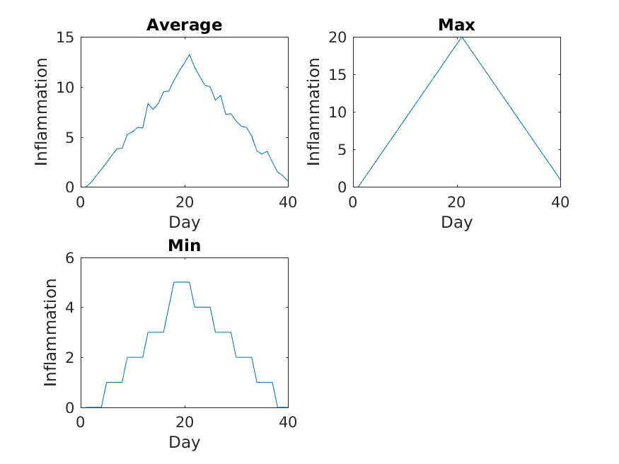
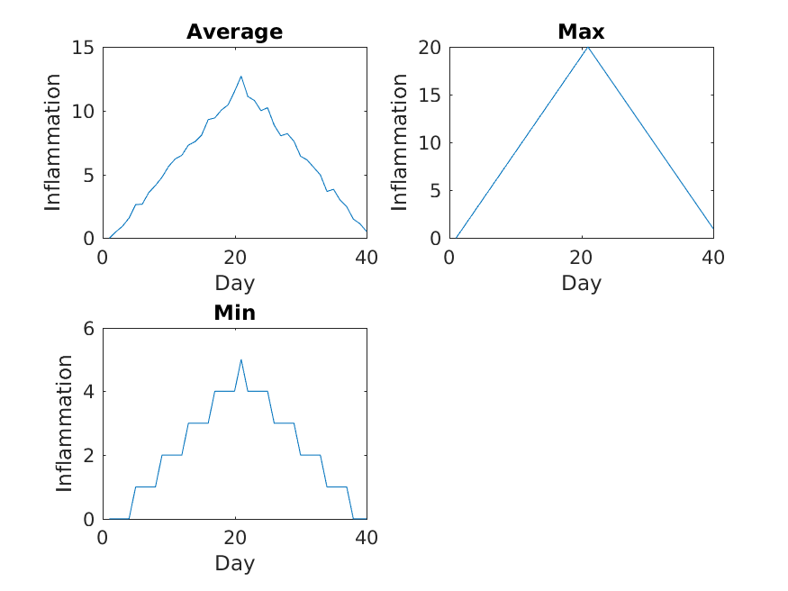

Recall that we have to do this analysis for every one of our dozen datasets, and we need a better way than
typing out commands for each one,
because we'll find ourselves writing a lot of duplicate code.
Remember, code that is repeated in two or more places
will eventually be wrong in at least one.
Also, if we  make changes in the way we analyze our datasets,
we have to introduce that change in every copy of our code.
To avoid all of this repetition, we have to teach MATLAB to
repeat our commands,
and to do *that*,
we have to learn how to write *loops*.

Suppose we want to print each character in the word "lead" on
a line of its own. One way is to use four `disp` statements:

~~~
%LOOP_DEMO   Demo script to explain loops

word = 'lead';

disp(word(1))
disp(word(2))
disp(word(3))
disp(word(4))
~~~
{: .language-matlab}

~~~
l
e
a
d
~~~
{: .output}

But this is a bad approach for two reasons:

1. It doesn't scale: if we want to print the characters
in a string that's hundreds of letters long, we'd be better
off typing them in.

2. It's fragile: if we change `word` to a longer string,
it only
prints part of the data, and if we change it to
a shorter one,
it produces an error, because we're asking for characters
that don't exist.

~~~
%LOOP_DEMO   Demo script to explain loops

word = 'tin';

disp(word(1))
disp(word(2))
disp(word(3))
disp(word(4))
~~~
{: .language-matlab}

~~~
error: A(I): index out of bounds; value 4 out of bound 3
~~~
{: .error}

There's a better approach:

~~~
%LOOP_DEMO   Demo script to explain loops

word = 'lead';

for letter = 1:4
    disp(word(letter))
end
~~~
{: .language-matlab}

~~~
l
e
a
d
~~~
{: .output}

This improved version uses a [for loop]({{ page.root }}/reference.html#for-loop) to
repeat an operation---in this case, printing to the screen---once for
each element in an array.

The general form of a for loop is:

~~~
for variable = collection
    do things with variable
end
~~~
{: .source}

The for loop executes the commands in the
[loop body]({{ page.root }}/reference.html#loop-body)
for every value in the array `collection`.
This value is called the [loop variable]({{ page.root }}/reference.html#loop-variable),
and we can call it whatever we like.
In our example, we gave it the name `letter`.

We have to terminate the loop body with the `end` keyword,
and we can have as many commands as we like in the loop body.
But, we have to remember
that they will all be repeated as many times as
there are values in `collection`.

Our for loop has made our code more scalable,
and less fragile.
There's still one little thing about it that should bother us.
For our loop to deal appropriately with shorter or longer words,
we have to change the first line of our loop by hand:

~~~
%LOOP_DEMO   Demo script to explain loops

word = 'tin';

for letter = 1:3
    disp(word(letter))
end
~~~
{: .language-matlab}

~~~
t
i
n
~~~
{: .output}

Although this works,
it's not the best way to write our loop:

* We might update `word` and forget to modify the loop to reflect that
  change.

* We might make a mistake while counting the number of letters in
  `word`.

Fortunately,
MATLAB provides us with a convenient function to
write a better loop:

~~~
%LOOP_DEMO   Demo script to explain loops

word = 'aluminum';

for letter = 1:length(word)
    disp(word(letter))
end
~~~
{: .language-matlab}

~~~
a
l
u
m
i
n
u
m
~~~
{: .output}

This is much more robust code,
as it can deal identically with
words of arbitrary length.
Loops are not only for working with strings,
they allow us to do repetitive
calculations regardless of data type.
Here's another loop that
calculates the sum of all even numbers between 1 and 10:

~~~
%LOOP_DEMO   Demo script to explain loops

total = 0;
for even_number = 2 : 2 : 10
    total = total + even_number;
end

disp('The sum of all even numbers between 1 and 10 is:')
disp(total)
~~~
{: .language-matlab}

It's worth tracing the execution of this little program step by step.

> ## The debugger
> We can use the MATLAB debugger to trace the execution of a program.
>
> The first step is to set a **break point** by clicking just to the
> right of a line number on the `-` symbol.
> A red circle will appear --- this is the break point,
> and when we run the script, MATLAB will pause execution at that line.
>
> A green arrow appears, pointing to the next line to be run.
> To continue running the program one line at a time, we use the `step` button.
>
> We can then inspect variables in the workspace or by hovering the cursor
> over where they appear in the code,
> or get MATLAB to evaluate expressions in the command window
> (notice the prompt changes to `K>>`).
>
> This process is useful to check your understanding of a program,
> in order to correct mistakes.
>
> This process is illustrated below:
> 
{: .callout}

Since we want to sum only even numbers,
the loop index `even_number` starts at 2
and increases by 2 with every iteration.
When we enter the loop, `total` is zero -
the value assigned to it beforehand.
The first time through, the loop body adds
the value of the first even number (2) to the
old value of `total` (0), and updates
`total` to refer to that new value.
On the next loop iteration, `even_number` is 4
and the initial value of `total` is 2,
so the new value assigned to `total` is 6.
After `even_number` reaches the final value (10),
`total` is 30;
since this is the end of the range for `even_number`
the loop finishes and the `disp` statements give us the
final answer.

Note that a loop variable is just a variable
that's being used to record progress in a loop.
It still exists after the loop is over,
and we can re-use variables previously defined as loop variables as well:

~~~
>> disp(even_number)
~~~
{: .language-matlab}

~~~
10
~~~
{: .output}

> ## Performing Exponentiation
>
> MATLAB uses the caret (`^`) to perform exponentiation:
>
> ~~~
> >> disp(5^3)
> ~~~
> {: .language-matlab}
>
> ~~~
> 125
> ~~~
> {: .output}
>
> You can also use a loop to perform exponentiation.
> Remember that `b^x` is just
> `b*b*b*`... `x` times.
>
> Let a variable `b` be the base of the number and `x` the exponent.
> Write a loop to compute `b^x`.
> Check your result for `b = 4` and `x = 5`.
>
> > ## Solution
> > ```
> > % Loop to perform exponentiation
> > b = 4;    % base
> > x = 5;    % exponent
> >
> > result=1;
> > for i = 1:x
> >     result = result * b;
> > end
> >
> > disp([num2str(b), '^', num2str(x), ' = ', num2str(result)])
> > ```
> > {: .language-matlab}
> {: .solution}
{: .challenge}

> ## Incrementing with Loops
>
> Write a loop that spells the word "aluminum," adding one letter at a time:
>
> ~~~
> a
> al
> alu
> alum
> alumi
> alumin
> aluminu
> aluminum
> ~~~
> {: .output}
> > ## Solution
> > ```
> > % spell a string adding one letter at a time using a loop
> >
> > word = 'aluminium';
> >
> > for letter = 1:length(word)
> >     disp(word(1:letter))
> > end
> > ```
> > {: .language-matlab}
> {: .solution}
 {: .challenge}

> ## Looping in Reverse
>
> In MATLAB, the colon operator (`:`) accepts a
> [stride]({{ page.root }}/reference.html#stride)
> or skip argument between the start and stop:
>
> ~~~
> >> disp(1:3:11)
> ~~~
> {: .language-matlab}
>
> ~~~
> 1 4 7 10
> ~~~
> {: .output}
>
> ~~~
> >> disp(11:-3:1)
> ~~~
> {: .language-matlab}
>
> ~~~
> 11 8 5 2
> ~~~
> {: .output}
>
> Using this,
> write a loop to print the letters of "aluminum"
> in reverse order, one letter per line.
>
> ~~~
> m
> u
> n
> i
> m
> u
> l
> a
> ~~~
> {: .output}
> > ## Solution
> > ```
> > % Spell a string in reverse using a loop
> >
> > word = 'aluminium';
> >
> > for letter = length(word):-1:1
> >     disp(word(letter))
> > end
> > ```
> > {: .language-matlab}
> {: .solution}
{: .challenge}

## Analyzing patient data from multiple files
We now have almost everything we need to process
multiple data files using a loop and the plotting code in our
`plot_patient1` script.

We still need to generate a list of data files to process,
and then we can use a loop to repeat the analysis for each file.

We can use the `dir` command to return a **structure array** containing
the names of the files in the `data` directory.
Each element in this *structure array* is a **structure**, containing
information about a single file in the form of named **fields**.

```
>> files = dir('data/inflammation-*.csv')
```
{: .language-matlab}

```
files =
  12×1 struct array with fields:
    name
    folder
    date
    bytes
    isdir
    datenum
```
{: .output}

To access the *name* field of the first file, we can use the following syntax:

```
>> filename = files(1).name;
>> disp(filename)
```
{: .language-matlab}

```
inflammation-01.csv
```
{: .output}

To get the modification date of the third file, we can do:

~~~
>> mod_date = files(3).date;
>> disp(mod_date)
~~~
{: .language-matlab}

~~~
26-Jul-2015 22:24:31
~~~
{: .output}

A good first step towards processing multiple files is to write a loop which prints
the name of each of our files.
Let's write this in a script `plot_all.m` which we will then develop further:

```
%PLOT_ALL	Developing code to automate inflammation analysis

files = dir('data/inflammation-*.csv');

for i = 1:length(files)
	file_name = files(i).name;
	disp(file_name)
end
```
{: .language-matlab}


```
>> plot_all
```
{: .language-matlab}

~~~
inflammation-01.csv
inflammation-02.csv
inflammation-03.csv
inflammation-04.csv
inflammation-05.csv
inflammation-06.csv
inflammation-07.csv
inflammation-08.csv
inflammation-09.csv
inflammation-10.csv
inflammation-11.csv
inflammation-12.csv
~~~
{: .output}

Another task is to generate the file names for the figures we're going to save.
Let's name the output file after the data file used to generate the figure.
So for the data set `inflammation-01.csv` we will call the figure `inflammation-01.png`.
We can use the `replace` command for this purpose.

The syntax for the `replace` command is like this:

```
NEWSTR = replace(STR, OLD, NEW)
```
{: .language-matlab}

So for example if we have the string `big_shark` and want to get the string
`little_shark`, we can execute the following command:

```
>> new_string = replace('big_shark', 'big', 'little');
>> disp(new_string)
```
{: .language-matlab}

```
little_shark
```
{: .output}


> ## GNU Octave
>
> In Octave, the `replace` function doesn't exist,
> but the `strrep` function is a direct replacement.
> The above example becomes
> ```
> >> new_string = strep('big_shark', 'big', 'little')
> little_shark
> ```
> {: .language-matlab}
{: .callout}

Recall that we're saving our figures to the `results` directory.
The best way to generate a path to a file in MATLAB is by using the `fullfile` command.
This generates a file path with the correct separators for the platform you're using
(i.e. forward slash for Linux and macOS, and backslash for Windows).
This makes your code more portable which is great for collaboration.

Putting these concepts together, we can now generate the paths for the data files,
and the image files we want to save:

```
%PLOT_ALL	Developing code to automate inflammation analysis

files = dir('data/inflammation-*.csv');

for i = 1:length(files)
    file_name = files(i).name;

    % Generate string for image name
    img_name = replace(file_name, '.csv', '.png');

    % Generate path to data file and image file
    file_name = fullfile('data', file_name);
    img_name = fullfile('results',img_name);

    disp(file_name)
    disp(img_name)
end
```
{: .language-matlab}

```
data/inflammation-01.csv
results/inflammation-01.png
data/inflammation-02.csv
results/inflammation-02.png
data/inflammation-03.csv
results/inflammation-03.png
data/inflammation-04.csv
results/inflammation-04.png
data/inflammation-05.csv
results/inflammation-05.png
data/inflammation-06.csv
results/inflammation-06.png
data/inflammation-07.csv
results/inflammation-07.png
data/inflammation-08.csv
results/inflammation-08.png
data/inflammation-09.csv
results/inflammation-09.png
data/inflammation-10.csv
results/inflammation-10.png
data/inflammation-11.csv
results/inflammation-11.png
data/inflammation-12.csv
results/inflammation-12.png
```
{: .output}

We're now ready to modify `plot_all.m` to actually process multiple data files:

~~~
%PLOT_ALL   Print statistics for all patients.
%           Save plots of statistics to disk.

files = dir('data/inflammation-*.csv');

% Process each file in turn
for i = 1:length(files)
    file_name = files(i).name;

    % Generate strings for image names:
    img_name  = replace(file_name, '.csv', '.png');

    % Generate path to data file and image file
    file_name = fullfile('data', file_name);
    img_name  = fullfile('results', img_name);

    patient_data = readmatrix(file_name);

    % Create figures
    figure('visible', 'off')

    subplot(2, 2, 1)
    plot(mean(patient_data, 1))
    title('Average')
    ylabel('Inflammation')
    xlabel('Day')

    subplot(2, 2, 2)
    plot(max(patient_data, [], 1))
    title('Max')
    ylabel('Inflammation')
    xlabel('Day')

    subplot(2, 2, 3)
    plot(min(patient_data, [], 1))
    title('Min')
    ylabel('Inflammation')
    xlabel('Day')

    print(img_name, '-dpng')
    close()
end
~~~
{: .language-matlab}

We run the modified script using its name in the Command Window:

~~~
>> plot_all
~~~
{: .language-matlab}

The first three figures output to the `results` directory are as shown below:






Sure enough, the maxima of these data sets show exactly
the same ramp as the first,
and their minima show the same staircase structure.

We've now automated the analysis and have confirmed that all the data
files we have looked at show the same artifact. This is what we set out to test, and now
we can just call one script to do it. With minor modifications, this
script could be re-used to check all our future data files.
