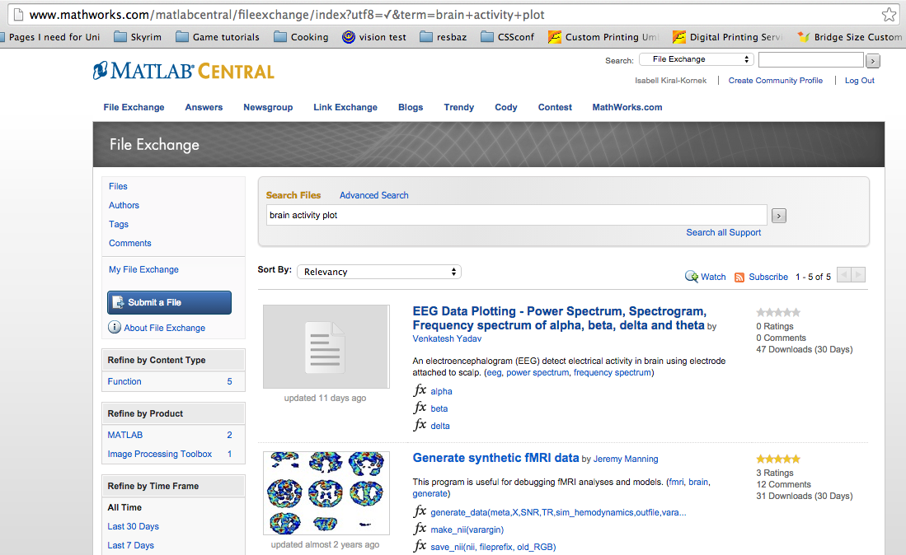
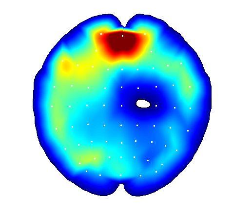

> ## Learning Objectives {.objectives}
> * Apply the core software carpentry skills in the field of biomedical engineering.
> * Loading .mat-files 
> * Logical indexing

Some researchers were able to control a quadrocoptor with [nothing but thoughts](https://www.youtube.com/watch?v=-h3kiws4I54). 
Now we want to replicate this work.

To do this, first we need to measure brain activity. 
This can be done using EEG (electroencephalogram). A test participant wears a cap with 
embedded electrodes. The participant then repeatedly moves their left or right hand or no hand at all, 
while we measure the electric field with the electrodes. Luckily this data has 
already been recorded and can be downloaded [here](https://github.com/EwanNurse/A-Generalizable-BCI-using-Machine-Learning-for-Feature-Discovery/tree/master/data). We'll be using 'EEG_ParticipantB_30_09_2013.mat'.

Once we have downloaded the first data file, we want to:

* load this data into memory
* classify the data into right hand movement, left hand movement, no movement
* calculate the average brain activity on each electrode for each class
* plot the result using some code we found on the Internet 
* find out which electrodes are most active

First, let's have a look at the data file we downloaded. 
The file is a .mat-file. This is a special MATLAB file type that can be used
to store multiple variables at once. 
To load the stored variables back into memory, type 

~~~ {.matlab}
load('data/EEG_ParticipantB_28_09_2013.mat');
~~~

If we have a look at our Workspace, we see that two new variables have been loaded:
data_epoch_B and data_key_B.

The recorded data is stored in `data_epoch_B`, the classification key is
stored in `data_key_B`. 

Each column in data_epoch_B contains the recorded data of one trial, 
corresponding to one value in data_key_B (1 = left hand press, 2 = right 
hand press, 3 = no hand press).
The first 100 values in each column are the recordings during 0.4 ms 
of one electrode, the second 100 values of the second electrode and 
so on. 

We now want to have not one, but three arrays, one for each condition 
(1 = left hand press, 2 = right hand press, 3 = no hand press).
MATLAB provides us with a handy way of obtaining all indexes for fields that 
meet a certain condition. This method is called logical indexing.

For example, we have recorded how many mice our cat caught each day for one week.

~~~ {.matlab}
mice = [4 5 2 6 7 8 3];
~~~

Now if we want to know how often our cat has brought home 4 or more mice, we 
can check that by typing:

~~~ {.matlab}
mice>=4
~~~

The response is a vector with ones wherever this condition is true.

~~~ {.output}
ans = 1     1     0     1     1     1     0
~~~

And even look at which values it takes

~~~ {.matlab}
vector(vector>=2)
~~~

> ## Classify your data {.challenge}
> 1.  Write a script that loads the file 'EEG_ParticipantB_28_09_2013.mat' and
reorganises the data 'data_epoch_B' into three new variables using the key provided in 'data_key_B'.
Note that in 'data_key_B', 1 means no hand was squeezed, 2 means the right hand was squeezed, and 3
means the left hand was squeezed.

We've now grouped the data in three groups, but in order to visualise it, 
we might want to compute the average of each group and each channel (we now have 100 values
per channel.)

> ## Averages across multiple dimensions {.challenge}
> 1.  For each of the three groups, calculate the mean over groups. Then, using a for-loop, 
calculate the mean for each electrode. The resulting vector for each group should have size 62x1.

Now, we want to plot the data. We could go ahead and write our own plotting function, 
but for a (relatively) common task like plotting EEG data, we could instead have
a look to see if someone has already written a function. 
A good place to look for code is [MATLAB File Exchange]("http://www.mathworks.com/matlabcentral/fileexchange/").
Other users write and upload code that can then be rated.

We've found the what we need to plot our EEG data, a function 
called 'BrainMap'.
The code we downloaded needs some more data for configuration. Luckily all that data is provided in 
'brain_data_for_BrainMap.mat'. 

~~~ {.matlab}
load('data/brain_data_for_BrainMap.mat');
BrainMap(neither_mean,x_full, y_full, mx, my);
~~~

Here are the images we should be seeing:

No hand squeeze:

Left hand squeeze:

Right had squeeze:

> ## Can we animate brain activity? {.challenge}
> 1. Using BrainMap, what do you think you need to do in order to display the brain activity over time?
Hints: If you want to display something in the same figure, you can type figure(1)=plot(...), you can also introduce a pause of one second between commands using pause(1)

We can clearly see that the activity in the brain differs for the different activities 
we recorded. For trained people, this brain activity also differs if they
just think about the action of squeezing a hand. Having a clear idea of these measurement values, we should be able
to control a motor using nothing but brain measurements. 

